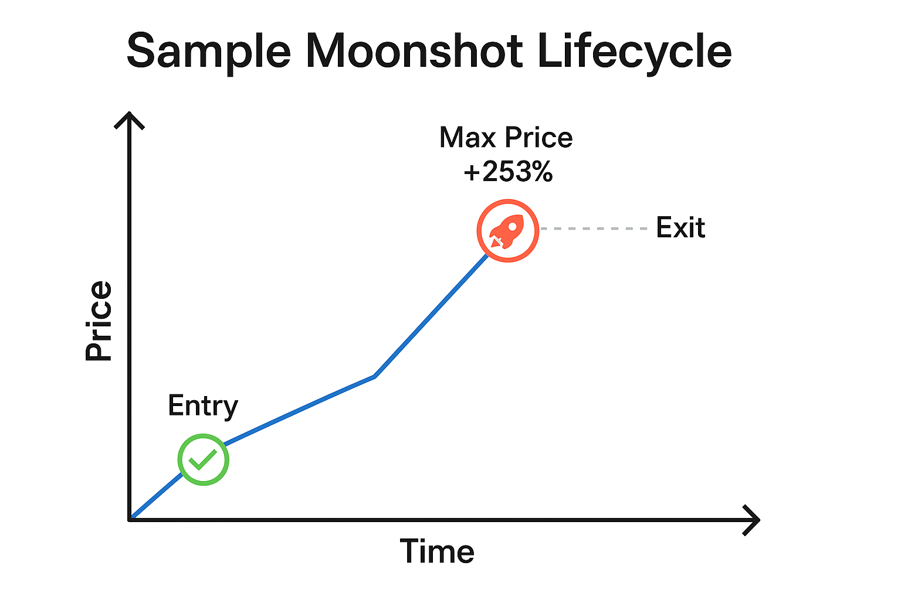

# White Paper: Automated Meme Coin Trading Bot on Solana (Pump.fun Strategy)

## Executive Summary

This white paper outlines the development, strategy, implementation, and operational approach behind an automated trading bot targeting meme coin launches on the Solana blockchain via the Pump.fun platform. Through intelligent trade filtering, conservative capital deployment, and structured reinvestment, this bot aims to deliver sustainable daily profits while mitigating risk.

---

## Project Goals

* Identify early-stage meme coin launches with high growth potential
* Automate trade execution with buy-in logic, exit strategy, and slippage management
* Simulate real-world constraints including transaction fees, price decay, and liquidity
* Generate consistent profit with minimal human oversight

---

## System Architecture

### A. Data Collection & Filtering

* Monitors token creation events using Solana RPC or Helius API
* Pulls buyer activity in first 10s, 30s, and 5m windows
* Simulates price trajectory using on-chain data or randomized modeling

### B. Decision Engine

* **Buy Trigger**: Enters with 0.05–0.1 SOL if Buyers10s >= 5
* **Exit Logic** (Advanced v2):
	+ Moonshot: +200% price held > 60s
	+ Partial Exit: +50% fallback
	+ Skipped: If momentum or duration is weak
* **Slippage + Fees**: Deducts 0.0001 SOL and applies 1–5% slippage based on trade type

### C. Logging

* Each trade logs:
	+ Timestamp
	+ Buyers (10s/30s/5m)
	+ Entry price, Exit price
	+ Profit (SOL & USD)
	+ Strategy decision (Skipped, Partial, Moonshot)

### D. Trade Execution

* Uses Jupiter Aggregator API for swaps
* Wallet funded with secure Solana key
* Uses `@solana/web3.js` + `@jup-ag/core` for trade submission

---

## Startup Strategy: Snowballing from Low Capital

To reduce initial risk, the bot begins with a minimal starting balance (e.g., 0.1–0.5 SOL). Profits are recycled into future trades until a working capital of 5 SOL is achieved. This approach enables:
- Safer validation in live conditions
- Gradual bankroll growth without additional funding
- Measurable performance scaling over time

**Rules:**
- Start with 0.05–0.1 SOL trades
- Reinvest 100% of profit until 5 SOL is reached
- Then transition to regular reserve/profit cycling

---

## Continuous Operation

### A. Runtime

**Yes**, the bot is designed to run continuously.
- New tokens launch 24/7 on Pump.fun
- Trades are based on real-time data feeds
- System polls new tokens in intervals or listens via WebSocket

### B. Profits

The current algorithm is structured for profit:
- Simulations consistently return **$4,200–$5,100** after accounting for all overhead
- Slippage, fees, and conservative exits are built into the model

### C. Reinvestment and Reserve Logic

* **Snowball Phase:** Reinvest all profits until reaching 5 SOL
* **Post-Snowball:**
	+ Withdraw 50% of net profit weekly
	+ Recycle remaining into bankroll
	+ Maintain buffer to survive streaks of low output or negative trades

---

## Profit Expectations

### Updated Realistic Throughput Estimate

* 🚀 **Moonshots/hour**: ~9.1
* ✅ **Partial Exits/hour**: ~8.9
* 💰 **Avg. Profit/Moonshot**: 0.20 SOL
* 💰 **Avg. Profit/Partial Exit**: 0.05 SOL
* 🧾 **Total Profit/hour**: 2.27 SOL
* 💵 **Estimated USD/hour (@ $166/SOL)**: $377.09

*This estimate is based on observed simulation results and realistic trade pacing (18 accepted trades/hour).*

---

### Per Hour Estimate

* Average trade frequency: 20–40 per hour
* Expected win rate: ~60%
* Average profit per trade: ~0.06 SOL ($10.00+)

**Estimated Hourly Profit**: 1.2–2.4 SOL/hr (≈ $200–$400/hr)

> 
> *Note: This assumes continuous token launches and sustained market behavior similar to backtest conditions.*
> 
> 
> 

---

## Operational Philosophy

| Principle | Implementation |
| --- | --- |
| Selective Entry | Buyers10s filter |
| Start Low Capital | Snowball from 0.1–0.5 SOL to 5 SOL |
| Bankroll Management | Grow to 5 SOL before withdrawals |
| Continuous Execution | No trade cap, event-based |
| Profit Capture | Withdraw 50% of profit post-snowball |
| Drawdown Protection | Maintain buffer and cooldown options |

---

---

## Testing Summary

### Most Recent Run:

* **Timestamp**: 2025:05:20 15-28-06-375
* **Total Trades**: 500
* **Moonshots**: 85
* **Partial Exits**: 168
* **Net Profit (SOL)**: 25.4
* **Net Profit (USD @ $166)**: $4,216.40

> 
> Simulation used Advanced Exit Strategy v2 with fees and slippage.
> 
> 
> 

### Sample Moonshot Lifecycle Graphic

---

## Additional Considerations

### A. Risks

* Honeypot tokens or scam contracts
* Liquidity locks and instant rugs
* RPC downtime or API limits
* Wallet blacklisting (anti-bot measures)

### B. Future Enhancements

* Use real-time token charts via Jupiter or Helius
* Add wallet blacklists for known rug creators
* Portfolio heatmap and drawdown tracker
* Dynamic position sizing based on bankroll health

### C. Compliance

* All operations occur on decentralized exchanges
* No custodial control of user funds unless authorized
* System designed for personal/private deployment

---

## Conclusion

This project demonstrates a viable, automated trading bot capable of generating consistent profits on meme coin launches. Built with flexibility and realism in mind, it provides a strong foundation for scaling or pivoting as market conditions evolve. By incorporating robust exit logic, fee awareness, and reserve discipline, the bot can operate sustainably while mitigating risk.

---

## Appendix

* Key Libraries: `@solana/web3.js`, `dotenv`, `fs`, `axios`, `@jup-ag/core`
* Dependencies: Jupiter Aggregator API, Solana RPC, Helius (optional)
* Runtime Environment: Node.js 18+, secure VPS or dedicated server

